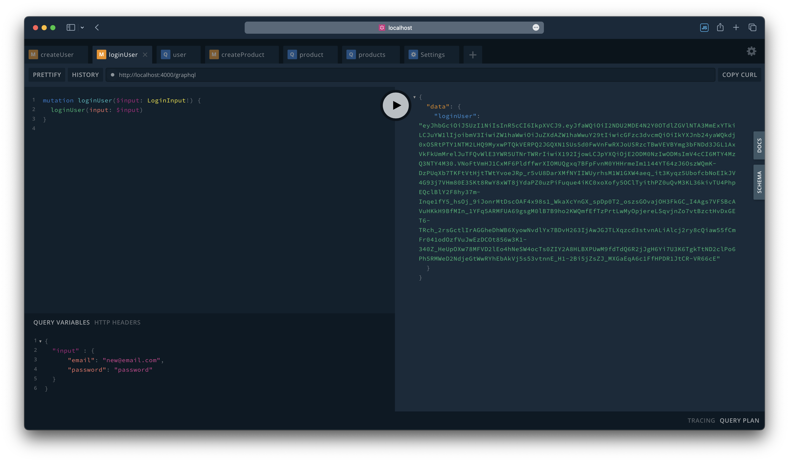

# GraphQL API



## GraphQL Queries

To test the application, please click on the following link to view all the queries.

| Queries                 | Link                                           |
| ----------------------- | ---------------------------------------------- |
| Create User Mutation    | [`Link`](./GraphQL.md#create-user-mutation)    |
| Login User Mutation     | [`Link`](./GraphQL.md#login-user-mutation)     |
| Get User Query          | [`Link`](./GraphQL.md#get-user-query)          |
| Create Product Mutation | [`Link`](./GraphQL.md#create-product-mutation) |
| Get Product Query       | [`Link`](./GraphQL.md#get-product-query)       |
| Get Products Query      | [`Link`](./GraphQL.md#get-products-query)      |

## Bootstrap Server

Run the following commands

```bash
    mkdir gql-api
    cd gql-api
    echo "node_modules\n.DS_Store\n.env" > .gitignore
    git init
    npm init -y
    npm install -g typescript
    tsc --init -y
```

## Install Dependencies

```bash
    npm i --save type-graphql apollo-server graphql@15.x reflect-metadata @typegoose/typegoose mongoose class-validator bcrypt jsonwebtoken cookie-parser config dotenv
```

## Install Dev-Dependencies

```bash
    npm install --save-dev @types/express @types/node @types/cors @types/jsonwebtoken @types/lodash pino-pretty @types/cookie-parser ts-node-dev typescript
```

## Generate Encryption Keys

Change to the project's root directory and execute the following bash command

```bash
    mkdir certs && cd certs && openssl genpkey -algorithm RSA -out private_key.pem -pkeyopt rsa_keygen_bits:4096 && openssl rsa -in private_key.pem -pubout -out public_key.pem
```
